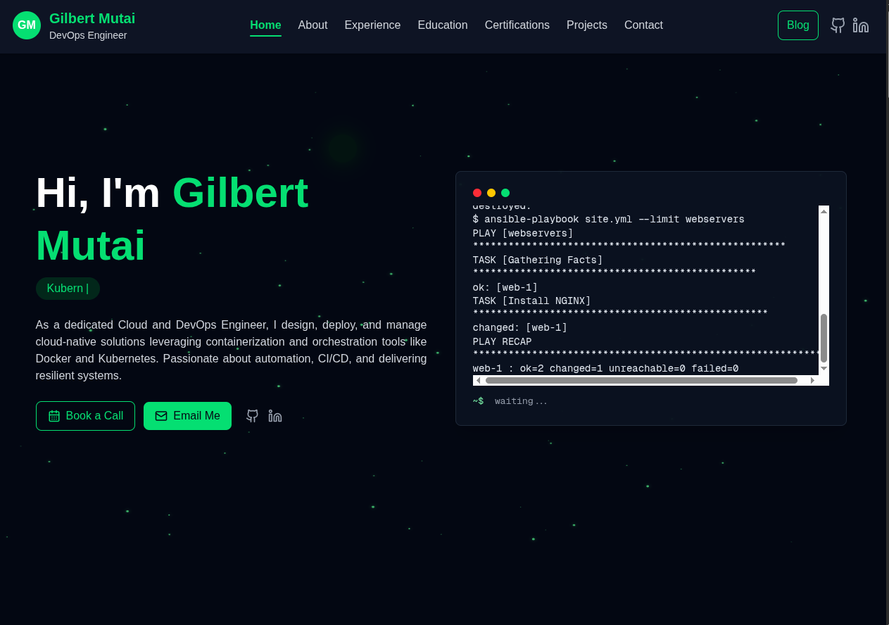

# 🌐 Gilbert Mutai – Cloud & DevOps Engineer Portfolio

This is my personal portfolio website built using **Next.js (React)**, **Tailwind CSS**, and **shadcn/ui**, showcasing my certifications, cloud projects, and DevOps skillset.  

It highlights my journey in **Cloud Engineering**, **Automation**, and **DevOps**, and serves as a central hub for my professional work and achievements.

---

## 🚀 Tech Stack

- **Framework:** Next.js (React 18)
- **Styling:** Tailwind CSS + shadcn/ui
- **Icons:** Lucide React, React Icons
- **Animations:** Framer Motion
- **Deployment:** Vercel / AWS Amplify / Netlify

---

## 🧩 Features

- ⚡ Interactive Hero, About, and Projects sections  
- 🧠 Real certifications with verification links  
- 🧰 “Core Skills & Tools” badge grid  
- 📅 “Book a Call” modal powered by Calendly  
- 📱 Fully responsive and mobile-friendly  
- 🌗 Sleek dark theme with hover and motion effects  

---

## 🖼️ Screenshot

Below is a preview of the portfolio homepage:



---

## 🛠️ Installation & Setup

```bash
# Clone this repository
git clone https://github.com/gilbert-mutai/Portfolio

# Navigate to the project directory
cd 

# Install dependencies
npm install

# Start the development server
npm run dev
```

Visit **http://localhost:3000** to view the site locally.

---

## 🏗️ Folder Structure

```
app/
 ├── components/        # Reusable UI components (Hero, About, Navbar, etc.)
 ├── layout.tsx         # Global layout and theme setup
 ├── page.tsx           # Home page
 └── styles/            # Tailwind configurations

public/
 ├── assets/            # Static images and icons
 └── favicon.ico
```

---

## 🧾 Certifications

Here are some of the certifications showcased on my site:
- **AWS Certified Cloud Practitioner**
- **KCNA: Kubernetes and Cloud Native Associate**
- **AWS re/Start Graduate**
- **LFS250: Kubernetes and Cloud Native Essentials**
- **CCNA Series (Introduction to Networks, Switching, Enterprise)**
- **Introduction to Cybersecurity**

Each certification links directly to its **Credly verification page**.

---

## 🌍 Deployment

You can deploy this project easily using:

### **Vercel (Recommended)**
```bash
npm run build
vercel deploy
```

Or host it on **AWS Amplify**, **Netlify**, or any platform that supports Next.js.

---

## 📫 Contact

**Gilbert Mutai**  
Cloud & DevOps Engineer  
📍 Nairobi, Kenya  
🌐 [LinkedIn](https://www.linkedin.com/in/gilbertmutai/) • [GitHub](https://github.com/gilbert-mutai/Portfolio)  

---

⭐ If you like this project, consider giving it a **star** on GitHub — it helps others discover it!
